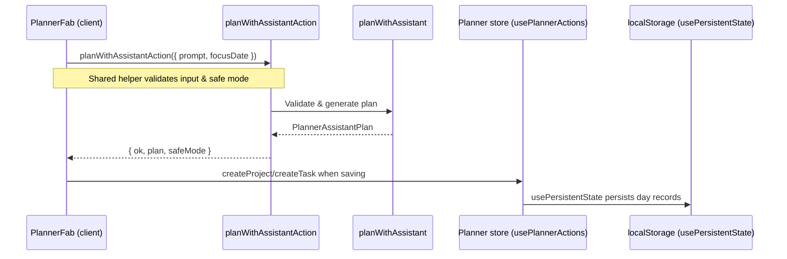

# Planner Request Flow

This document traces how planner data moves from the client UI through shared
assistant logic and into persistent storage. The planner relies on a shared
TypeScript helper for assistant requests, and browser `localStorage` serves as
the persistence layer for planner content.

## High-level flow

1. **User submits a planner request.** The floating planner button component
   builds the prompt from the user's input and calls the shared
   `planWithAssistantAction` helper while keeping track of concurrent requests.
2. **Assistant request validation.** The helper parses the request, normalizes
   the safe-mode state, and routes the payload to shared business logic.
3. **Planner assistant synthesis.** The `planWithAssistant` helper sanitizes the
   prompt, enforces token budgets, generates task/project suggestions, and
   packages the result with safety metadata.
4. **Client integrates assistant output.** The component updates its local state
   with assistant suggestions. When the user saves, it invokes planner CRUD
   helpers that wrap the shared planner store.
5. **Persistent storage update.** The planner store uses `usePersistentState`
   to write the updated day records into browser `localStorage`, providing the
   database-like durability for planner data.

## Detailed steps

### 1. Client interaction

The floating action button component (`PlannerFab`) debounces requests and calls
`planWithAssistantAction` from the client. It guards against stale responses and
records safe-mode state from the response.

- Trims user input, bails if empty, and starts a React transition before calling
the assistant helper.【F:src/components/planner/PlannerFab.tsx†L383-L437】
- Persists planner entries via helper functions that are triggered when the user
saves their plan, eventually delegating to CRUD utilities for projects and
tasks.【F:src/components/planner/PlannerFab.tsx†L240-L336】

### 2. Assistant boundary validation

`planWithAssistantAction` resolves the safe-mode configuration, validates the
request schema, translates domain errors into user-facing messages, and produces
the success envelope consumed by the client component.【F:src/lib/assistant/plannerAssistantAction.ts†L1-L108】

### 3. Planner assistant synthesis

`planWithAssistant` prepares the sanitized prompt, enforces token budgets,
produces suggestions, and validates the resulting plan structure before
returning it to the caller.【F:src/lib/assistant/plannerAgent.ts†L239-L320】

### 4. Planner store updates

When the user saves a suggestion, the component calls `usePlannerActions`
(`createProject`/`createTask`), which leverage `makeCrud` to apply immutable day
updates through the shared planner store.【F:src/components/planner/usePlannerStore.ts†L184-L220】【F:src/components/planner/plannerCrud.ts†L1-L63】

The planner store exposes `upsertDay`, `getDay`, and other helpers built on top
of persistent state so that all updates funnel through the same mutation
path.【F:src/components/planner/usePlannerStore.ts†L120-L163】

### 5. Persistence layer

`PlannerProvider` seeds the store by reading from `localStorage` using the
`usePersistentState` hook, which loads from storage after hydration, syncs across
tabs, and writes every state change back to the same key.【F:src/components/planner/plannerContext.tsx†L215-L259】【F:src/lib/db.ts†L300-L402】

This hook relies on `createStorageKey` and queued writes to ensure that updates
are serialized safely into `localStorage`, giving the planner a browser-native
persistence layer.【F:src/lib/db.ts†L30-L110】【F:src/lib/db.ts†L232-L288】

## Mermaid sequence diagram

